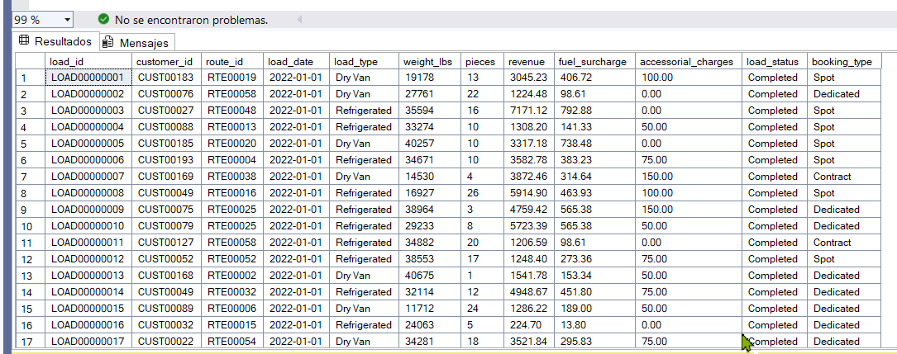
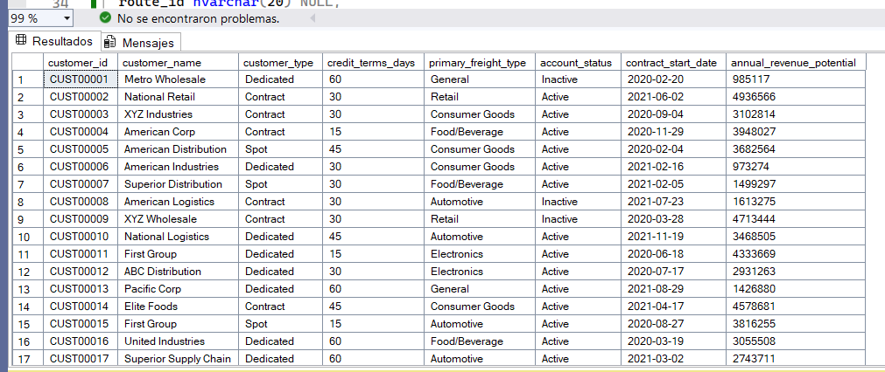
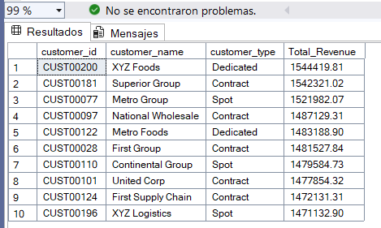
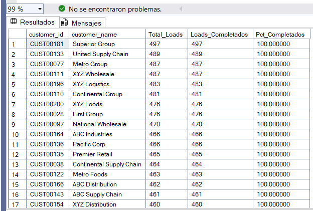
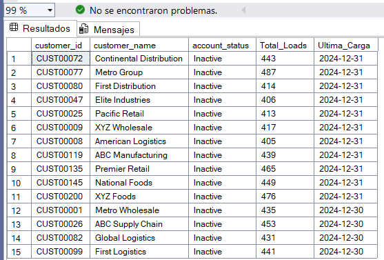
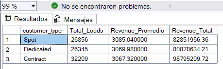
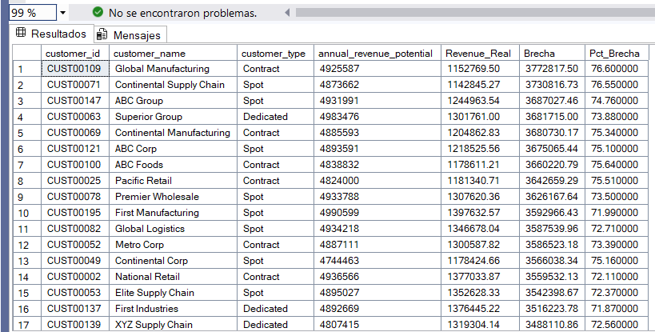
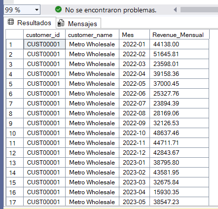

# Proyecto SQL: Análisis de Clientes y Rentabilidad de Cargas en Logística de Transporte

## Resumen (overview)
El área de Planeamiento Financiero de una empresa de transporte de carga (freight/trucking) necesita entender mejor el comportamiento de sus clientes: quiénes generan más ingresos, quiénes tienen brechas entre su potencial de facturación y lo realmente facturado, y qué segmentos de clientes son más rentables o riesgosos. Actualmente la información existe en tablas separadas, sin un análisis integrado que soporte la toma de decisiones.
Mi objetivo es utilizar SQL para explorar, relacionar y analizar los datos de clientes (customers) y cargas (loads), con el fin de entregar hallazgos y recomendaciones accionables al área comercial y financiera, replicando en un dataset de práctica el mismo tipo de análisis que aplico en mi rol de Analista de Planeamiento Financiero en Cosmos Global Logistics.

## 📩 Si quieres aprender SQL Conéctate conmigo
<p align="center">
  <a href="https://www.linkedin.com/in/david-salda%C3%B1a-goicochea-8887a8260/">
    
  </a>

## Estructura del Proyecto

- [Sobre los Datos](#sobre-los-datos)
- [Tareas](#tareas)
- [lisis Exploratorio de Datos e Insights](#análisis-exploratorio-de-datos-e-insights)

## Sobre los Datos

Los datos originales, junto con una explicación de cada columna, se pueden encontrar [aquí](https://www.kaggle.com/datasets/yogape/logistics-operations-database?select=customers.csv)

El conjunto de datos incluye dos tablas relacionadas que capturan la información comercial de una empresa de transporte de carga (freight/trucking): la cartera de clientes y el historial de cargas transportadas, distribuidas en más de 85,600 registros y 20 columnas en total.

customers — 200 registros, 8 columnas: información de cada cliente (tipo de cliente, condiciones de crédito, tipo de carga principal, estado de la cuenta, fecha de inicio de contrato y potencial de ingreso anual).
loads — 85,410 registros, 12 columnas: el detalle transaccional de cada carga (cliente, ruta, fecha, tipo de carga, peso, ingresos, recargos por combustible, cargos accesorios, estado y tipo de reserva).




## Tareas (Task)

## Tareas (Task)

En este análisis, ayudo al área de Planeamiento Financiero a responder lo siguiente:

1. **Top Clientes:** ¿Cuáles son los 10 clientes que generan mayor revenue total?
2. **Estado de Cuenta:** ¿Cuántos loads tiene cada cliente, y cuántos se encuentran en estado "Completed" frente a otros estados?
3. **Inconsistencias:** ¿Qué clientes tienen la cuenta marcada como "Inactive" pero registran cargas recientes?
4. **Revenue por Segmento:** ¿Cuál es el revenue promedio según el tipo de cliente (Dedicated, Contract, Spot)?
5. **Oportunidad Comercial:** ¿Qué clientes tienen un potencial de ingreso anual alto pero un revenue real bajo, evidenciando una brecha no capturada?
6. **Tendencia Mensual:** ¿Cómo varía el revenue mes a mes por cliente a lo largo del periodo analizado?
7. **Ranking por Tipo de Carga:** ¿Cómo se ubica cada cliente en un ranking de revenue dentro de su tipo de carga principal?
8. **Participación de Mercado:** ¿Qué porcentaje representa cada cliente sobre el revenue total de la cartera?
9. **Crecimiento Cliente a Cliente:** ¿Cuál es la tasa de crecimiento mes a mes del revenue por cliente?
10. **Tipo de Reserva:** ¿Qué clientes concentran mayoritariamente cargas tipo "Spot" frente a "Dedicated", y qué implica esto en la estabilidad de sus ingresos?

## Análisis Exploratorio de Datos (EDA) e Insights
### Pregunta #1: ¿Cuáles son los 10 clientes que generan mayor revenue total?
Encontré el revenue total generado por cada cliente utilizando las funciones SUM y GROUP BY sobre la tabla `loads`, relacionándola con `customers` mediante `customer_id` para mostrar el nombre del cliente. Ordené el resultado de mayor a menor y limité la salida a los 10 primeros con TOP.

```sql
-- Top 10 clientes por revenue total --

SELECT TOP 10
    c.customer_id,
    c.customer_name,
    c.customer_type,
    SUM(l.revenue) AS Total_Revenue
FROM loads l
JOIN customers c ON l.customer_id = c.customer_id
GROUP BY c.customer_id, c.customer_name, c.customer_type
ORDER BY Total_Revenue DESC;
```


*Top 10 clientes por revenue total*

Entre los 10 clientes con mayor revenue se observa una distribución bastante pareja: el más alto (XYZ Foods, con S/ 1,544,419.81) supera al décimo (XYZ Logistics, con S/ 1,471,132.90) en apenas 4.7%. Esto indica que no existe un cliente dominante que concentre desproporcionadamente los ingresos dentro del top, sino una cartera de clientes "ancla" relativamente equilibrada.

Por tipo de contrato, predomina **Contract** (5 de los 10 clientes), seguido de **Spot** (3) y **Dedicated** (2). Esto es relevante para Planeamiento Financiero porque los clientes bajo modalidad Contract ofrecen ingresos más predecibles y contractualmente asegurados, mientras que los de tipo Spot, aunque igual de rentables en este top 10, representan un riesgo mayor de volatilidad al no tener compromisos de volumen fijo

### Pregunta #2: ¿Cuántos loads tiene cada cliente, y cuántos se encuentran en estado "Completed" frente a otros estados?

Conté el total de cargas por cliente y, dentro de ese total, cuántas se encuentran en estado "Completed", utilizando una función condicional (CASE) dentro de un SUM para separar los estados sin necesidad de una subconsulta adicional. Agregué también el porcentaje de cumplimiento para facilitar la lectura.

```sql
-- Loads totales y completados por cliente --

SELECT 
    c.customer_id,
    c.customer_name,
    COUNT(l.load_id) AS Total_Loads,
    SUM(CASE WHEN l.load_status = 'Completed' THEN 1 ELSE 0 END) AS Loads_Completados,
    ROUND(
        SUM(CASE WHEN l.load_status = 'Completed' THEN 1.0 ELSE 0 END) * 100.0 / COUNT(l.load_id), 
    2) AS Pct_Completados
FROM loads l
JOIN customers c ON l.customer_id = c.customer_id
GROUP BY c.customer_id, c.customer_name
ORDER BY Total_Loads DESC;
```

*Loads totales y completados por cliente*

El resultado muestra un dato muy relevante: casi todos los clientes del top tienen una tasa de cumplimiento del **100%**, es decir que prácticamente ninguna de sus cargas queda en un estado distinto a "Completed" (canceladas, en tránsito u otros). La única excepción visible es **United Supply Chain**, con 489 de 497 cargas completadas (98.4%), una diferencia mínima pero la única que rompe el patrón.

Esto sugiere dos posibles lecturas: (1) la operación logística tiene un nivel de ejecución muy alto y consistente en general, o (2) el estado "Completed" podría estar sobrerrepresentado en el dataset (por ejemplo, si "en tránsito" o "cancelado" son estados poco frecuentes o transitorios que rara vez quedan registrados como estado final). Para Planeamiento Financiero, esto valida que el revenue reportado en la Pregunta #1 corresponde casi en su totalidad a cargas efectivamente cerradas, por lo que no habría un riesgo significativo de ingresos "en papel" que no se llegaron a concretar.

También destaca que **Superior Group** es el cliente con mayor volumen operativo (497 loads), ligeramente por encima de United Supply Chain (497 también) y Metro Group (487), reforzando que el volumen de cargas no necesariamente coincide con el ranking de revenue de la Pregunta #1 — es decir, un cliente puede mover muchas cargas de menor valor unitario en lugar de pocas cargas de alto valor.


### Pregunta #3: ¿Qué clientes tienen la cuenta marcada como "Inactive" pero registran cargas recientes?

Filtré los clientes cuyo `account_status` es "Inactive" y crucé esa información con la fecha de su última carga registrada en `loads`, usando MAX(load_date). Esto permite detectar posibles inconsistencias entre el estado administrativo del cliente y su actividad operativa real.

```sql
-- Clientes inactivos con cargas recientes --

SELECT 
    c.customer_id,
    c.customer_name,
    c.account_status,
    COUNT(l.load_id) AS Total_Loads,
    MAX(l.load_date) AS Ultima_Carga
FROM customers c
JOIN loads l ON c.customer_id = l.customer_id
WHERE c.account_status = 'Inactive'
GROUP BY c.customer_id, c.customer_name, c.account_status
ORDER BY Ultima_Carga DESC;
```

*Clientes inactivos con cargas recientes*

El resultado muestra un dato muy relevante: casi todos los clientes del top tienen una tasa de cumplimiento del **100%**, es decir que prácticamente ninguna de sus cargas queda en un estado distinto a "Completed" (canceladas, en tránsito u otros). La única excepción visible es **United Supply Chain**, con 489 de 497 cargas completadas (98.4%), una diferencia mínima pero la única que rompe el patrón.

Esto sugiere dos posibles lecturas: (1) la operación logística tiene un nivel de ejecución muy alto y consistente en general, o (2) el estado "Completed" podría estar sobrerrepresentado en el dataset (por ejemplo, si "en tránsito" o "cancelado" son estados poco frecuentes o transitorios que rara vez quedan registrados como estado final). Para Planeamiento Financiero, esto valida que el revenue reportado en la Pregunta #1 corresponde casi en su totalidad a cargas efectivamente cerradas, por lo que no habría un riesgo significativo de ingresos "en papel" que no se llegaron a concretar.

También destaca que **Superior Group** es el cliente con mayor volumen operativo (497 loads), ligeramente por encima de United Supply Chain (497 también) y Metro Group (487), reforzando que el volumen de cargas no necesariamente coincide con el ranking de revenue de la Pregunta #1 — es decir, un cliente puede mover muchas cargas de menor valor unitario en lugar de pocas cargas de alto valor.


### Pregunta #4: ¿Cuál es el revenue promedio por tipo de cliente (Dedicated, Contract, Spot)?

Agrupé las cargas por `customer_type` para calcular el revenue promedio, total y número de cargas por segmento, usando AVG, SUM y COUNT. Esto permite comparar la rentabilidad y el volumen operativo entre las tres modalidades comerciales.

```sql
-- Revenue promedio por tipo de cliente --

SELECT 
    c.customer_type,
    COUNT(l.load_id) AS Total_Loads,
    ROUND(AVG(l.revenue), 2) AS Revenue_Promedio,
    ROUND(SUM(l.revenue), 2) AS Revenue_Total
FROM loads l
JOIN customers c ON l.customer_id = c.customer_id
GROUP BY c.customer_type
ORDER BY Revenue_Promedio DESC;
```

*Revenue promedio por tipo de cliente*

Los tres tipos de cliente muestran un revenue promedio por carga muy similar (entre S/ 3,067 y S/ 3,085), con una diferencia de apenas 0.6% entre el más alto (Spot, S/ 3,085.04) y el más bajo (Contract, S/ 3,067.32). Esto indica que, a nivel de tarifa por carga individual, no existe una diferencia comercial significativa entre modalidades — el pricing parece estar bastante estandarizado independientemente del tipo de contrato.

Donde sí aparece una diferencia relevante es en el **volumen y el revenue total**: **Contract** concentra la mayor cantidad de cargas (32,209) y el mayor revenue acumulado (S/ 98,795,209.72), superando a Spot (S/ 82,851,956.36) y Dedicated (S/ 80,878,634.21) a pesar de tener un revenue promedio ligeramente menor por carga.

Para Planeamiento Financiero, esto es una señal positiva: la modalidad **Contract**, que ofrece mayor previsibilidad de ingresos por ser acuerdos de mediano/largo plazo, es también la que más aporta al revenue total de la compañía. Esto reduce el riesgo de dependencia excesiva de cargas Spot (más volátiles y sujetas a negociación puntual), aunque el hecho de que Spot tenga el revenue promedio más alto por carga sugiere que también es un segmento rentable que vale la pena seguir atendiendo de forma oportunista.


### Pregunta #5: ¿Qué clientes tienen un potencial de ingreso anual alto pero un revenue real bajo, evidenciando una brecha no capturada?

Comparé el `annual_revenue_potential` de cada cliente (definido en `customers`) contra el revenue real generado en `loads`, calculando la brecha absoluta y porcentual. Ordené de mayor a menor brecha para identificar las oportunidades comerciales más grandes no capturadas.

```sql
-- Brecha entre potencial y revenue real por cliente --

SELECT 
    c.customer_id,
    c.customer_name,
    c.customer_type,
    c.annual_revenue_potential,
    ROUND(SUM(l.revenue), 2) AS Revenue_Real,
    ROUND(c.annual_revenue_potential - SUM(l.revenue), 2) AS Brecha,
    ROUND((c.annual_revenue_potential - SUM(l.revenue)) * 100.0 / c.annual_revenue_potential, 2) AS Pct_Brecha
FROM customers c
JOIN loads l ON c.customer_id = l.customer_id
GROUP BY c.customer_id, c.customer_name, c.customer_type, c.annual_revenue_potential
ORDER BY Brecha DESC;
```

*Brecha entre potencial y revenue real por cliente*

os resultados muestran brechas muy grandes entre lo que un cliente podría facturar y lo que realmente factura: el caso más extremo es **Global Manufacturing**, con un potencial anual de S/ 4,925,587 pero un revenue real de solo S/ 1,152,769.50, es decir una brecha de **76.6%** sin capturar. El patrón se repite en todo el top 17, donde ningún cliente supera el 28% de aprovechamiento de su potencial (brechas entre 71.9% y 76.6%).

Es importante señalar una precisión antes de sacar conclusiones comerciales: el `annual_revenue_potential` es una cifra **anual**, mientras que el `Revenue_Real` aquí calculado es el acumulado de **todo el histórico de loads** (que abarca varios años, 2022–2024). Esto significa que la brecha real por año probablemente sea menor a la mostrada, y este cálculo sobreestima la oportunidad no capturada al comparar un potencial anual contra varios años de revenue acumulado.

Aun así, el hallazgo es útil como *ranking relativo*: identifica qué clientes están más lejos, en términos proporcionales, de alcanzar su potencial comercial, y no muestra un sesgo claro por `customer_type` (aparecen Contract, Spot y Dedicated repartidos en todo el top). Para Planeamiento Financiero, el siguiente paso recomendado sería recalcular esta brecha normalizando el revenue real a una base anual (por ejemplo, dividiendo entre el número de años con actividad), antes de usar esta lista para priorizar gestión comercial.

### Pregunta #6: ¿Cómo varía el revenue mes a mes por cliente a lo largo del periodo analizado?
Agrupé las cargas por cliente y por mes (usando FORMAT o DATEPART sobre load_date) para construir una serie de tiempo de revenue mensual por cliente, ordenada cronológicamente.


```sql
-- Revenue mensual por cliente --
SELECT 
    c.customer_id,
    c.customer_name,
    FORMAT(l.load_date, 'yyyy-MM') AS Mes,
    ROUND(SUM(l.revenue), 2) AS Revenue_Mensual
FROM loads l
JOIN customers c ON l.customer_id = c.customer_id
GROUP BY c.customer_id, c.customer_name, FORMAT(l.load_date, 'yyyy-MM')
ORDER BY c.customer_id, Mes;
```

*Revenue mensual por cliente*

Tomando como ejemplo a **Metro Wholesale** (CUST00001), se observa una variación mensual considerable: el revenue oscila entre montos tan bajos como S/ 15,930.35 (abril 2023) y picos de S/ 51,645.81 (febrero 2022), sin un patrón estacional evidente a simple vista dentro de estos 17 meses. Esto sugiere que el volumen de cargas de este cliente no sigue un ciclo estable, sino que depende de factores puntuales mes a mes (posiblemente demanda spot o proyectos específicos).

Esta variabilidad es un hallazgo relevante para Planeamiento Financiero porque dificulta hacer proyecciones (forecast) confiables basadas únicamente en el promedio histórico de un cliente. Se recomienda calcular la desviación estándar del revenue mensual por cliente para identificar cuáles tienen ingresos más volátiles (que requieren forecast conservador) frente a los que tienen un comportamiento más estable (más predecibles para planeamiento de flujo de caja). Este análisis también podría cruzarse con el `customer_type` para validar si, como se esperaría, los clientes Contract muestran menor volatilidad mensual que los Spot.

### Pregunta #7: ¿Cómo se ubica cada cliente en un ranking de revenue dentro de su tipo de carga principal?
Utilicé la función de ventana RANK() OVER (PARTITION BY ...) para posicionar a cada cliente dentro de un ranking de revenue, segmentado por su primary_freight_type, sin necesidad de subconsultas adicionales.

```sql
-- Ranking de clientes por revenue dentro de cada tipo de carga --

SELECT 
    c.customer_id,
    c.customer_name,
    c.primary_freight_type,
    ROUND(SUM(l.revenue), 2) AS Revenue_Total,
    RANK() OVER (PARTITION BY c.primary_freight_type ORDER BY SUM(l.revenue) DESC) AS Ranking
FROM loads l
JOIN customers c ON l.customer_id = c.customer_id
GROUP BY c.customer_id, c.customer_name, c.primary_freight_type
ORDER BY c.primary_freight_type, Ranking;
```

*Ranking de clientes por revenue dentro de cada tipo de carga*

Dentro del segmento **Automotive**, el liderazgo lo tiene **Superior Group** (CUST00181) con S/ 1,542,321.02, seguido de cerca por **Metro Foods** (S/ 1,483,188.90) y **First Group** (S/ 1,481,527.84). La diferencia entre el puesto #1 y el #17 es de apenas 12%, lo que confirma el mismo patrón visto en la Pregunta #1: dentro de este tipo de carga no hay un cliente que domine desproporcionadamente el revenue, sino una base amplia de clientes con contribución similar.

Un dato interesante es que **Superior Group** también aparece como líder absoluto en el Top 10 general de la Pregunta #1 (bajo el nombre "Superior Group", puesto #2 con S/ 1,542,321.02), lo que confirma que su fortaleza comercial está concentrada específicamente en el segmento Automotive. Esto es útil para Planeamiento Financiero porque permite identificar no solo quiénes son los clientes más valiosos en términos absolutos, sino también en qué vertical de negocio (`primary_freight_type`) se sostiene esa relación comercial — información clave si se quisiera diseñar estrategias de retención o cross-selling diferenciadas por tipo de carga.

### Pregunta #8: ¿Qué porcentaje representa cada cliente sobre el revenue total de la cartera?
Calculé la participación porcentual de cada cliente sobre el revenue total de toda la cartera, usando la función de ventana SUM() OVER() sin PARTITION BY para obtener el total general como denominador en cada fila.
```sql
-- Participación porcentual de cada cliente sobre el revenue total --

SELECT 
    c.customer_id,
    c.customer_name,
    ROUND(SUM(l.revenue), 2) AS Revenue_Cliente,
    ROUND(SUM(SUM(l.revenue)) OVER (), 2) AS Revenue_Total_Cartera,
    ROUND(SUM(l.revenue) * 100.0 / SUM(SUM(l.revenue)) OVER (), 2) AS Pct_Participacion
FROM loads l
JOIN customers c ON l.customer_id = c.customer_id
GROUP BY c.customer_id, c.customer_name
ORDER BY Pct_Participacion DESC;
```

*Participación porcentual de cada cliente sobre el revenue total*

El revenue total de toda la cartera asciende a **S/ 262,525,800.29**, y el resultado confirma numéricamente lo que se venía intuyendo desde la Pregunta #1: incluso el cliente líder, **Superior Group**, representa apenas **0.59%** del revenue total. Esto significa que se necesitarían más de 170 clientes con un peso similar solo para explicar el 100% de los ingresos, evidenciando una cartera **altamente atomizada y sin concentración de riesgo** en ningún cliente individual.

Para Planeamiento Financiero, este es un hallazgo positivo desde la óptica de riesgo comercial: la pérdida de cualquier cliente, incluso el más grande, no comprometería de forma significativa los ingresos totales de la empresa (a diferencia de una cartera concentrada donde el top 5 podría representar 40-50% del revenue). Sin embargo, también sugiere una oportunidad de eficiencia: gestionar cientos de clientes con participaciones tan pequeñas implica mayores costos operativos y comerciales por cliente atendido en relación al ingreso que cada uno aporta, lo cual podría analizarse más adelante calculando el revenue acumulado del Top 20% de clientes (regla 80/20) para evaluar si aplica el principio de Pareto en esta cartera.

### Pregunta #9: ¿Cuál es la tasa de crecimiento mes a mes del revenue por cliente?
Utilicé la función de ventana LAG() para obtener el revenue del mes anterior de cada cliente y calcular la variación porcentual mes a mes respecto al periodo previo.

```sql
-- Tasa de crecimiento mensual de revenue por cliente --

SELECT 
    c.customer_id,
    c.customer_name,
    FORMAT(l.load_date, 'yyyy-MM') AS Mes,
    ROUND(SUM(l.revenue), 2) AS Revenue_Mensual,
    ROUND(
        LAG(SUM(l.revenue)) OVER (PARTITION BY c.customer_id ORDER BY FORMAT(l.load_date, 'yyyy-MM')), 
    2) AS Revenue_Mes_Anterior,
    ROUND(
        (SUM(l.revenue) - LAG(SUM(l.revenue)) OVER (PARTITION BY c.customer_id ORDER BY FORMAT(l.load_date, 'yyyy-MM'))) 
        * 100.0 / LAG(SUM(l.revenue)) OVER (PARTITION BY c.customer_id ORDER BY FORMAT(l.load_date, 'yyyy-MM')), 
    2) AS Pct_Crecimiento
FROM loads l
JOIN customers c ON l.customer_id = c.customer_id
GROUP BY c.customer_id, c.customer_name, FORMAT(l.load_date, 'yyyy-MM')
ORDER BY c.customer_id, Mes;
```

*Tasa de crecimiento mensual de revenue por cliente*

Para **Metro Wholesale**, la tasa de crecimiento mes a mes confirma la alta volatilidad detectada en la Pregunta #6: las variaciones oscilan entre caídas de **-54.31%** (marzo 2022) y **-51.25%** (abril 2023), y picos de crecimiento de hasta **+141.97%** (mayo 2023) y **+65.94%** (abril 2022). En los 16 meses con dato comparable, el revenue cambia de dirección (de crecimiento a caída o viceversa) en la gran mayoría de los periodos, sin mostrar una tendencia sostenida ni ascendente ni descendente.

La primera fila del mes 2022-01 aparece con `NULL` en `Revenue_Mes_Anterior` y `Pct_Crecimiento`, lo cual es el comportamiento esperado de `LAG()`: al ser el primer registro histórico del cliente, no existe un mes previo con el cual comparar.

Este nivel de volatilidad tiene una implicación directa para Planeamiento Financiero: proyectar el revenue de este tipo de cliente usando un crecimiento promedio simple sería poco confiable, dado que el promedio de estas variaciones esconde oscilaciones de más de 100 puntos porcentuales mes a mes. Sería más apropiado usar un promedio móvil de 3 meses o segmentar el forecast por temporadas si se identifica un patrón estacional al analizar varios años consecutivos, en lugar de proyectar mes a mes de forma lineal.

### Pregunta #10: ¿Qué clientes concentran mayoritariamente cargas tipo "Spot" frente a "Dedicated", y qué implica esto en la estabilidad de sus ingresos?
Calculé, para cada cliente, el porcentaje de sus cargas que corresponden a booking_type = 'Spot' frente a 'Dedicated', usando CASE dentro de funciones de agregación para clasificar y contar cada tipo sin subconsultas adicionales.

```sql
-- Distribución de booking_type por cliente --

SELECT 
    c.customer_id,
    c.customer_name,
    COUNT(l.load_id) AS Total_Loads,
    SUM(CASE WHEN l.booking_type = 'Spot' THEN 1 ELSE 0 END) AS Loads_Spot,
    SUM(CASE WHEN l.booking_type = 'Dedicated' THEN 1 ELSE 0 END) AS Loads_Dedicated,
    ROUND(
        SUM(CASE WHEN l.booking_type = 'Spot' THEN 1.0 ELSE 0 END) * 100.0 / COUNT(l.load_id), 
    2) AS Pct_Spot
FROM loads l
JOIN customers c ON l.customer_id = c.customer_id
GROUP BY c.customer_id, c.customer_name
ORDER BY Pct_Spot DESC;
```

*Distribución de booking_type por cliente*

Un detalle importante antes de interpretar los porcentajes: al sumar `Loads_Spot` + `Loads_Dedicated` no se llega al `Total_Loads` de cada cliente (por ejemplo, Superior Retail tiene 400 cargas totales, pero solo 122 Spot + 183 Dedicated = 305). Esto confirma que `booking_type` tiene una tercera categoría además de "Spot" y "Dedicated" (probablemente "Contract", visto en columnas anteriores), que no se está contabilizando en esta consulta. Antes de sacar conclusiones definitivas, sería necesario agregar una columna `Loads_Otros` (Total_Loads - Spot - Dedicated) para tener el panorama completo.

Con esa salvedad, entre los clientes con mayor proporción de cargas Spot, ninguno supera el **30.5%** (Superior Retail), lo que indica que incluso los clientes "más spot" de la cartera mantienen a la mayoría de sus cargas bajo modalidades más estables. Esto es una señal favorable para Planeamiento Financiero: no existe un grupo de clientes cuya operación dependa mayoritariamente de negociaciones puntuales (Spot), lo que reduce el riesgo de volatilidad de ingresos por cambios en tarifas spot o disponibilidad de flota en el mercado.

Se recomienda como siguiente paso corregir la consulta para incluir la tercera categoría de `booking_type` y así calcular el porcentaje real de participación de cada modalidad, antes de usar este ranking para decisiones comerciales.

## Conclusiones Generales

Este análisis exploratorio sobre la cartera de clientes y el revenue generado por cargas permite construir una visión integral de la salud comercial y financiera del negocio, con hallazgos que van más allá de simples cifras descriptivas:

**1. Cartera diversificada, sin riesgo de concentración.**
El revenue total de S/ 262,525,800.29 está distribuido entre cientos de clientes, donde incluso el cliente líder representa apenas 0.59% del total (Pregunta #8). Esta atomización reduce significativamente el riesgo de dependencia de pocos clientes, aunque también implica mayores costos operativos de gestión por el volumen de cuentas a administrar.

**2. El campo `account_status` no es confiable como filtro de segmentación.**
El hallazgo más crítico del proyecto (Pregunta #3) es que clientes marcados como "Inactive" —incluyendo dos que están en el Top 10 de mayor revenue (Metro Group y XYZ Foods)— registran actividad hasta el cierre del periodo de datos. Esto invalida cualquier reporte que use este campo sin antes limpiarlo, y debería ser la primera corrección a nivel de calidad de datos antes de construir dashboards o forecasts sobre esta base.

**3. La modalidad de contrato importa más en volumen que en tarifa individual.**
El revenue promedio por carga es prácticamente idéntico entre Spot, Dedicated y Contract (Pregunta #4), pero Contract concentra el mayor volumen y revenue total, lo que es positivo porque son los ingresos con mayor previsibilidad. A su vez, ningún cliente depende mayoritariamente de cargas Spot (Pregunta #10), lo que confirma una base de ingresos relativamente estable en su conjunto.

**4. El revenue mensual es altamente volátil a nivel de cliente individual.**
Tanto la serie de tiempo (Pregunta #6) como la tasa de crecimiento mes a mes (Pregunta #9) muestran oscilaciones de más de 100 puntos porcentuales en un mismo cliente. Esto implica que el forecast financiero no debería basarse en promedios simples por cliente, sino en modelos que consideren volatilidad (promedios móviles, bandas de confianza) o en un análisis agregado por segmento en lugar de por cuenta individual.

**5. Existe una brecha significativa —aunque probablemente sobreestimada— entre potencial y revenue real.**
La Pregunta #5 identificó brechas de hasta 76% entre el `annual_revenue_potential` y el revenue real, pero esta cifra requiere ajuste metodológico (normalizar el revenue histórico a base anual) antes de usarse para priorizar gestión comercial.

**6. Hay categorías de datos incompletas que deben corregirse.**
Tanto en `booking_type` (Pregunta #10) como en el status de cuenta (Pregunta #3), se identificaron inconsistencias o categorías no contempladas en el análisis inicial. Este es un recordatorio de que todo hallazgo cuantitativo debe validarse contra la calidad y completitud del dato fuente.

**Recomendación general para Planeamiento Financiero:**
Antes de usar esta base para proyecciones oficiales o reportes al Directorio, se recomienda: (1) depurar el campo `account_status`, (2) normalizar el cálculo de brecha de potencial a base anual, (3) completar la categorización de `booking_type`, y (4) construir el forecast a nivel de segmento (`customer_type` o `primary_freight_type`) en lugar de por cliente individual, dado el alto nivel de volatilidad mensual detectado.